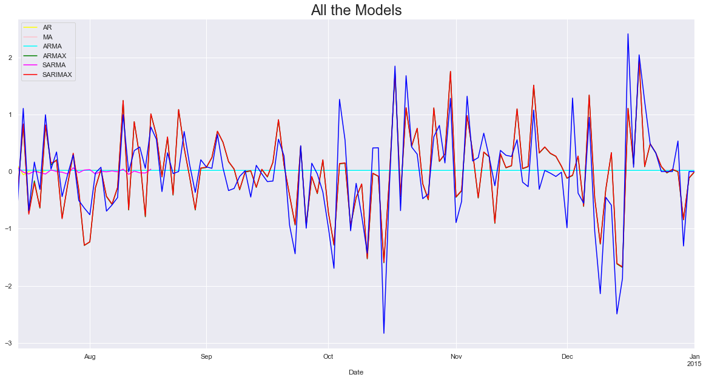

# Time Series Modeling and Volatility Forecasting of Financial Markets in Python

This repository contains the code and resources for a project focused on time series modeling and volatility forecasting of financial markets. The analysis was conducted on market indices like SPX and FTSE, using various statistical and econometric techniques to understand trends, ensure data stationarity, and forecast future prices and volatility.

## Project Overview



### Data Analytics and Preprocessing
- **Statistical Tests**: Conducted Augmented Dickey-Fuller (ADF) tests to check for stationarity.
- **Data Transformation**: Performed first-order differencing to convert non-stationary data into stationary data.
- **Tools Used**: Python, pandas, statsmodels, matplotlib.

### Time Series Modeling
- **Lag Analysis**: Plotted Autocorrelation Function (ACF) and Partial Autocorrelation Function (PACF) plots to identify significant lags.
- **Models Applied**:
  - **ARIMA**: AutoRegressive Integrated Moving Average.
  - **SARIMAX**: Seasonal AutoRegressive Integrated Moving-Average with eXogenous factors.
  - **Vector Models**: For multivariate time series forecasting.

### Volatility Forecasting
- **Models Used**:
  - **ARCH**: AutoRegressive Conditional Heteroskedasticity.
  - **GARCH**: Generalized AutoRegressive Conditional Heteroskedasticity.
  - **EWMA**: Exponentially Weighted Moving Average.
- **Purpose**: Robust forecasting and risk management of financial markets.

## Repository Contents

- `data/`: Contains the datasets used for analysis (ensure data is properly anonymized or use sample data).
- `notebooks/`: Jupyter notebooks with detailed step-by-step analysis and code.
  - Stationarity Testing and Data Differencing
  - ACF and PACF Plotting
  - Time Series Modeling (ARIMA, SARIMAX, Vector Models)
  - Volatility Forecasting (ARCH, GARCH, EWMA)
- `src/`: Python scripts for data preprocessing, modeling, and forecasting.
- `reports/`: Documentation and reports summarizing the findings and forecasts.
- `README.md`: Project overview and instructions.

## Getting Started

### Prerequisites

Ensure you have the following libraries installed:
- pandas
- numpy
- matplotlib
- statsmodels
- arch
- scipy

### Installation

Clone the repository:
```bash
git clone https://github.com/srujanra/financial-market-time-series.git
cd financial-market-time-series
```

### Usage

1. **Data Preparation**:
   - Place your datasets in the `data/` folder.
   - Run the preprocessing scripts or notebooks to clean and transform the data.

2. **Statistical Testing and Transformation**:
   - Use the stationarity testing notebook to perform ADF tests and first-order differencing.

3. **Time Series Modeling**:
   - Execute the notebooks or scripts for ACF/PACF plotting and model fitting (ARIMA, SARIMAX, Vector Models).

4. **Volatility Forecasting**:
   - Run the volatility forecasting scripts to apply ARCH, GARCH, and EWMA models.

5. **Analysis and Reporting**:
   - Review the generated plots, model outputs, and forecasted results in the reports.

## Contributing

Contributions are welcome! Please open an issue or submit a pull request for any improvements or new features.


## Acknowledgements

- Thanks to the open-source community for the libraries and tools used in this project.

---

Feel free to customize this description further to match the specifics of your project.
